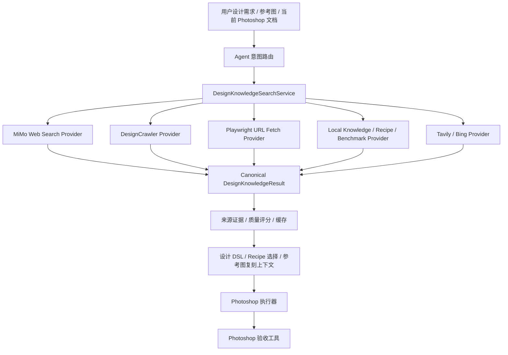

# 设计知识网页搜索能力规划

日期：2026-04-27

## 1. 定位

这份文档记录“通过网页搜索获取设计知识”的可行性、当前项目事实、落地边界和实施路线。

本能力的目标不是让 Agent 随意联网后直接控制 Photoshop，而是为设计任务提供可引用、可缓存、可复核的外部设计知识，例如设计趋势、品牌案例、版式参考、平台规范和可学习的制作方法。

## 2. 已核实事实

### 2.0 Harbor / SearXNG 本地 Web RAG 参考路径

当前规划把 Harbor / SearXNG 视为“本地 Web RAG 基础设施参考”，而不是 DesignEcho 的默认依赖。

可借鉴点：

1. Harbor 可用于本地 AI 技术栈编排研究，适合后续搭建本地模型、Web UI、搜索、图像和工作流实验环境。
2. SearXNG 可作为本地搜索聚合层，为设计知识搜索提供可控的搜索入口。
3. SearXNG 结果进入 DesignEcho 前必须先归一化为 `DesignKnowledgeResult`，保留 query、source、url、title、snippet、fetchedAt、evidenceLevel、sourceRank、provider 和失败原因；不要用无依据的未校准分数参与决策。
4. 本项目第一阶段只接“可配置 SearXNG endpoint + health probe + 搜索结果归一化”，不默认拉起 Docker，不管理 Harbor 生命周期。

切入顺序：

1. 先完成 Agent 观察/流式/能力边界，例如 provider thinking、model-visible reasoning、tool-calling streaming 和 provider capability matrix。
2. 再实现 SearXNG connector MVP，把本地搜索结果纳入统一设计知识 schema。
3. 然后把统一知识结果作为主图、详情页、SKU、参考图复刻的上下文引用。
4. 最后再评估是否需要 Harbor 作为开发者本地实验栈，而不是产品运行时强依赖。

边界：

1. SearXNG 搜索结果不能直接生成 Photoshop 工具调用。
2. 搜索摘要不能替代设计 DSL、recipe、Photoshop 验收或视觉 QA。
3. 如果 endpoint 不存在、健康检查失败或搜索结果缺引用，Agent 必须降级为“无外部知识证据”，不能伪造联网能力。

### 2.1 小米 MiMo Web Search 官方能力

已核实官方文档：

- 文档页：`https://platform.xiaomimimo.com/docs/usage-guide/tool-calling/web-search`
- 静态 Markdown：`https://platform.xiaomimimo.com/static/docs/usage-guide/tool-calling/web-search.md`

官方能力边界：

1. Web Search 是小米 MiMo 的内置联网搜索插件。
2. 请求中通过 `tools: [{ type: "web_search", max_keyword, force_search, limit, user_location }]` 启用。
3. 使用前需要在小米控制台启用 Web Search Plugin。
4. 支持流式和非流式响应。
5. 搜索来源会进入响应 `message.annotations`，类型为 `url_citation`。
6. `usage` 中可能包含 `web_search_usage`，用于统计插件调用。
7. 当前仅保留 `mimo-v2.5-pro`、`mimo-v2.5` 作为 MiMo Web Search 运行候选；`mimo-v2-pro`、`mimo-v2-omni` 已按官方下线节奏迁移到 V2.5 系列。
8. 官方说明 Anthropic API 路径不支持该 Web Search。
9. 费用由搜索插件调用费和模型 token 费组成；`max_keyword` 会影响一次请求可能触发的搜索次数。

注意：

1. 官方示例使用 `force_search`，FAQ 中出现 `forced_search` 字段。实现时应优先按示例字段接入，并用真实 API smoke 验证字段行为。
2. 当前尚未在本项目中对小米 Web Search 做真实 API 调用验证，不能写成已实现。

### 2.2 当前项目已有能力

代码中已存在以下相关能力：

1. `design-reference-search` skill。
2. `searchDesigns` 工具，当前通过 `DesignCrawlerMCP` 搜索花瓣、站酷、Behance。
3. `fetchWebPageDesignContent` 工具，当前通过 Playwright 获取指定网页标题、描述、正文和图片。
4. `TrendSensingService`，当前支持 Tavily / DuckDuckGo 路径，默认 DuckDuckGo Instant Answer API。
5. `AestheticKnowledgeService` 和设计领域定义文档，已有静态知识雏形。

当前不足：

1. 这些能力没有统一成“设计知识搜索真相源”。
2. 搜索结果缺少统一引用证据、缓存策略、来源质量评分和用途边界。
3. DuckDuckGo Instant Answer 对设计参考和趋势搜索质量有限。
4. 设计站点抓取器更像“作品参考搜索”，不是通用网页知识检索。
5. Playwright 网页提取只能抓指定 URL，不负责搜索与来源筛选。
6. 当前 Agent 的 tool schema 只支持 function tool，不支持小米 `type: "web_search"` 这种 provider-native tool 直接透传。

## 3. 可行性判断

结论：可以开发，但应分两层做，不能直接把联网搜索当成设计智能的完成态。

### 3.1 Provider-native Web Search

这是小米 MiMo 自带的搜索插件。

收益：

1. 支持实时信息。
2. 模型可以自己判断是否搜索，也可以强制搜索。
3. 返回引用来源，适合做用户可见证据链。
4. 可以结合 `mimo-v2.5` 的多模态理解能力，为参考图、趋势、案例分析提供上下文。

风险：

1. 依赖小米控制台插件开关。
2. 有额外搜索费用和 token 费用。
3. 当前项目 provider adapter 不能直接表达 provider-native tool。
4. 结果质量取决于搜索源和模型总结，不等于设计规则本身正确。
5. 外部网页内容不能直接作为 Photoshop 执行动作，必须经过安全归一化。

### 3.2 项目内部 Design Knowledge Search

这是项目自己的搜索/归一化/缓存/证据层。

收益：

1. 跨模型可用，不只依赖小米。
2. 可以统一接入 MiMo Web Search、Tavily、Bing、Playwright、设计站点搜索和本地案例库。
3. 可以输出稳定 schema，供 Agent、RAG、recipe 和 benchmark 复用。
4. 可以做来源白名单、质量评分、去重、缓存、审计日志和用户可读引用。

风险：

1. 工程量更大。
2. 需要维护搜索源和抓取策略。
3. 不解决“设计判断”本身，仍需要 DSL、recipe、验收和案例库。

## 4. 推荐架构

推荐采用混合方案：先建立项目内部的统一设计知识搜索层，再把小米 MiMo Web Search 作为其中一个 provider。



统一输出建议：

```ts
interface DesignKnowledgeResult {
  id: string;
  query: string;
  intent: "trend" | "reference" | "rule" | "recipe" | "brand" | "platform_spec";
  title: string;
  summary: string;
  url?: string;
  sourceName: string;
  sourceType: "mimo_web_search" | "design_crawler" | "web_page" | "local_case" | "local_recipe" | "manual_rule";
  citations: Array<{
    title: string;
    url: string;
    snippet?: string;
    publishedAt?: string;
  }>;
  visualAssets?: Array<{
    url: string;
    width?: number;
    height?: number;
    alt?: string;
  }>;
  evidenceLevel: "curated_rule" | "curated_recipe" | "external_snippet" | "local_case" | "benchmark_case" | "unknown";
  sourceRank: number;
  fetchedAt: string;
  expiresAt?: string;
  allowedUses: Array<"prompt_context" | "user_reference" | "recipe_hint" | "benchmark_seed">;
}
```

## 5. 实施路线

### Phase 1：规划与边界收口

状态：当前已完成可行性研究，尚未实现代码。

内容：

1. 把能力纳入 `project-master-plan.md` 与 `Backlog.md`。
2. 明确现有搜索能力不是可靠知识层。
3. 明确小米 Web Search 需要 provider-native tool 适配。
4. 明确外部知识不能直接控制 Photoshop。

验收：

1. 文档能区分已实现、规划中、未验证。
2. 项目记忆记录当前事实和风险。

### Phase 2：统一搜索服务 MVP

状态：已进入实现。`DesignKnowledgeSearchService` 已存在，本轮补入 SearXNG connector MVP。

目标：建立 `DesignKnowledgeSearchService`，先不强依赖小米。

内容：

1. 统一封装现有 `searchDesigns`、`fetchWebPageDesignContent`、`TrendSensingService`。
2. 输出 `DesignKnowledgeResult`。
3. 增加缓存、去重、来源字段和引用字段。
4. 新增 `searchDesignKnowledge` 工具，限制为“读取知识”，不执行 Photoshop。
5. 用户界面展示摘要和引用，不展示大段 raw HTML / raw JSON。

验收：

1. 搜索“电商详情页运动风参考”返回结构化结果。
2. 指定 URL 抓取后能进入同一结果 schema。
3. 所有结果包含 `sourceType`、`fetchedAt` 和引用字段。
4. smoke 覆盖空 query、无来源、URL fetch 失败和缓存命中。

#### Phase 2.1：SearXNG connector MVP

当前已实现：

1. 可选配置：`enabled` 与 `endpoint` 同时满足时才搜索。
2. 健康探针：`DesignKnowledgeSearchService.probeSearxngHealth()` 只检查 endpoint 可访问性，不触碰 Photoshop。
3. 结果归一化：SearXNG JSON results 进入 `DesignKnowledgeResult`，sourceType 为 `web_page`，tags 包含 `searxng`。
4. 失败降级：HTTP 失败、fetch 不可用、endpoint 缺失都只返回 warning，不伪造外部结果。
5. 边界：不管理 Docker / Harbor / SearXNG 生命周期，不把搜索结果转换为 Photoshop action。

当前未实现：

1. 设置页 UI。
2. 搜索缓存。
3. 来源质量评分。
4. 真实本地 SearXNG endpoint 的 live smoke。
5. 主图、详情页、SKU 的业务策略接入。

### Phase 3：小米 MiMo Web Search Provider

目标：让小米模型可以通过官方 Web Search 获取实时网页知识。

内容：

1. 扩展 provider adapter 类型，支持 provider-native tools。
2. 仅在 provider 为 `xiaomi` 且模型属于官方支持列表时允许注入 `web_search`。
3. 添加设置项：启用 Web Search、强制搜索、`max_keyword`、`limit`、成本提示。
4. 解析 `message.annotations` 为 citations。
5. 解析 `usage.web_search_usage`，用于日志和用户成本提示。
6. 新增 smoke：确认小米请求体含 `type: "web_search"`，非小米模型不会收到该 tool。

验收：

1. 无 API Key 或插件未启用时给出明确错误，不伪装成功。
2. 小模型或不支持模型不会注入 `web_search`。
3. 引用来源能进入用户可读回复和内部 evidence。
4. 如果搜索未发生，能区分模型未搜索、缓存延迟、插件未启用、模型不支持。

### Phase 4：设计任务集成

目标：把网页知识作为设计上下文，而不是执行命令。

首批接入场景：

1. 用户要求“找参考、找趋势、找案例”。
2. 用户提供行业和风格，Agent 需要补充设计方向。
3. 参考图复刻前，检索同类风格 recipe 或案例说明。
4. 详情页/主图/SKU 设计前，检索平台规范或行业案例。

禁止行为：

1. 网页内容不能直接生成 Photoshop 工具调用。
2. 未经归一化和验收的网页建议不能进入执行器。
3. 搜索摘要不能替代 Photoshop 结果验收。
4. 不能把搜索结果写成“设计结论已验证”。

## 6. 需要优先解决的技术点

1. Provider adapter 当前只支持 function tools，需要扩展 native tool 表达。
2. `ProviderResponse` 当前没有 citations / annotations 字段，需要补充。
3. `chatWithTools` 当前对小米使用 OpenAI SDK，需要确认 SDK 是否允许非标准 `tools` 项；如不允许，需要对小米 Web Search 路径改用 `fetch` 或 `extra_body`。
4. 搜索能力需要设置页开关和成本提示，不能默认隐藏调用。
5. 需要统一日志，记录 query、provider、引用、费用估计、缓存命中和失败原因。
6. 需要安全边界：搜索结果只能进入知识上下文，不能直接进入 Photoshop action plan。

## 7. 不承诺内容

1. 不承诺网页搜索后 Agent 就能自动做出优秀设计。
2. 不承诺搜索结果一定正确或来源质量足够。
3. 不承诺小米 Web Search 在未开通插件或未真实 API 验证前可用。
4. 不承诺网页搜索能替代本地 recipe、设计 DSL、Photoshop 验收和 benchmark。
5. 不承诺用普通文本 RAG 就能解决图片理解和版式审美问题。

## 8. 当前建议优先级

建议把该能力列为 P1 支撑基础设施，排在以下内容之后或并行推进：

1. Photoshop 验收证据链继续补齐。
2. 参考图复刻真实 benchmark。
3. 首批 visual recipe。
4. Agent provider observation capability / tool-calling streaming 边界。
5. SearXNG 本地 connector MVP。
6. 设计知识网页搜索统一服务 MVP。
7. 小米 Web Search provider-native 适配。

原因：

1. 没有验收工具，搜索得到的设计建议无法证明落地成功。
2. 没有 recipe 和 DSL，搜索知识只能变成泛泛建议。
3. 先做统一服务，可以避免把小米 Web Search 写死到 Agent 主链路里。
