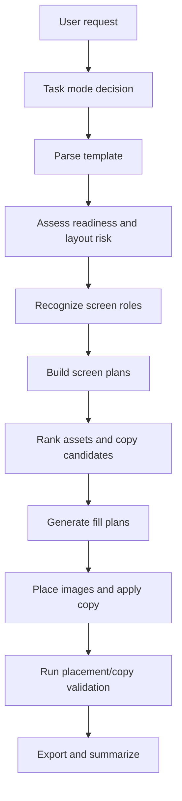

# Detail Page Design Agent Plan

## Goal

Build a real detail-page design agent, not just a template filler.

The system should be able to:

- understand what the user wants the detail page to achieve
- understand what each screen in the template is supposed to say
- choose images and copy based on screen role
- execute placement and copy fill deterministically in Photoshop
- validate the result before export
- expose enough MCP surface for debugging and iterative improvement

## Current State

The current pipeline already has useful building blocks:

- template parsing
- layer issue detection
- readiness assessment
- layout graph and layout risk scoring
- image fit decisions
- placeholder anchor diagnostics
- image placement execution
- placement audit and overlay snapshot debugging

Relevant files:

- `C:\DesignEcho\DesignEcho-Agent\src\renderer\services\skill-executors\detail-page.executor.ts`
- `C:\DesignEcho\DesignEcho-Agent\src\renderer\services\skill-executors\detail-page-plan-utils.ts`
- `C:\DesignEcho\DesignEcho-Agent\src\renderer\services\skill-executors\detail-page-layout-analyzer.ts`
- `C:\DesignEcho\DesignEcho-Agent\src\renderer\services\skill-executors\detail-page-image-fit.ts`
- `C:\DesignEcho\DesignEcho-UXP\src\tools\layout\detail-page-filler.ts`

What is still missing is the actual "design" layer:

- screen role understanding
- screen plan generation
- copy strategy per screen
- asset ranking per screen goal
- result validation beyond placement mechanics

## What Makes a Good Detail Page

A good detail page is not "more content". It is a controlled sequence of screens.

Core standards:

1. One screen, one core message.
2. Images are evidence, not decoration.
3. Copy translates visible features into user benefit and feeling.
4. Information hierarchy must be stable.
5. Adjacent screens should not repeat the same message.
6. Style and visual rhythm should stay consistent across the page.

## Design Agent Responsibilities

The detail-page agent should do six different jobs.

### 1. Task Mode Decision

The agent must first decide which mode the user is asking for:

- inspect-only
- auto-fill existing template
- semi-auto design
- restructure and redesign

This decision should happen before tool execution.

### 2. Template Understanding

The agent must inspect:

- how many screens exist
- where copy slots are
- where image slots are
- clipping and anchor relationships
- structural risks

This part already exists in the current pipeline and should remain deterministic.

### 3. Screen Role Recognition

Every screen should get a role, for example:

- hero
- core selling point
- material proof
- detail close-up
- wearing / usage scene
- parameter / comparison
- closing reassurance

Without this layer, the executor can fill a screen, but it cannot design the screen.

### 4. Screen Plan Generation

For every screen, the agent should produce a structured screen plan.

Recommended schema:

```ts
interface DetailScreenPlan {
  screenId: number;
  screenName: string;
  screenRole:
    | 'hero'
    | 'selling-point'
    | 'material-proof'
    | 'detail-proof'
    | 'scene'
    | 'parameter'
    | 'closing'
    | 'unknown';
  mainMessage: string;
  supportingPoints: string[];
  copyStrategy: 'headline' | 'benefit' | 'evidence' | 'parameter' | 'emotional';
  imageStrategy: 'hero' | 'context' | 'detail' | 'material' | 'comparison';
  visualPriority: 'copy-first' | 'image-first' | 'balanced';
  confidence: number;
  risks: string[];
}
```

This screen plan is the missing bridge between parsing and execution.

### 5. Deterministic Execution

The agent should then convert screen plans into execution plans:

- which asset to place in which placeholder
- what fill mode to use
- which copy goes to which text layer
- which screens should be guarded or degraded

The executor should stay deterministic here.

### 6. Validation and Export

Execution should always end with validation:

- placement audit
- overlap / offset checks
- copy overflow checks
- screen-level completion summary

Only then should export happen.

## Proposed End-to-End Flow



## MCP Strategy for Detail Page

The design agent needs MCP not for "more APIs", but for runtime truth.

### Priority 1: Runtime Context

Existing useful tools:

- `runtime.get_active_context`
- `runtime.get_recent_task_trace`

These already help answer:

- what document is active
- what screen / page / task is active
- what the agent just tried to do

### Priority 2: Detail-Page Structure

First new detail-page MCP tools should be:

1. `detail.get_template_graph`
   - return parsed screens, copy placeholders, image placeholders, clipping bases

2. `detail.get_screen_roles`
   - return current inferred role for each screen

3. `detail.get_screen_plan`
   - return the structured plan per screen

4. `detail.audit_placement`
   - wrap existing placement audit in stable MCP output

5. `detail.render_overlay_snapshots`
   - return before/after screen overlays for humans

### Priority 3: Debug Bundles

Later add:

- `detail.export_debug_bundle`

This should collect:

- template parse result
- screen plans
- fill plans
- placement audit
- overlay renders
- export summary

## Execution Modes

The agent should not run one universal pipeline for every request.

### Mode A: Inspect

Used for:

- "看一下这个详情页模板结构"
- "先别设计，只检查"

Output:

- readiness
- layout risk
- anchor risk
- screen role draft

### Mode B: Fill

Used for:

- template is already stable
- just need to place images and fill copy

Output:

- fill result
- audit result
- export result

### Mode C: Design

Used for:

- user wants a real detail-page design pass
- template provides placeholders but not message planning

Output:

- screen plans
- image strategy
- copy strategy
- fill result
- audit result

## Minimal Viable Closed Loop

The smallest real "detail-page design" loop should be:

1. Parse template
2. Assess layout/readiness
3. Infer screen role
4. Build one screen plan per screen
5. Convert screen plans to fill plans
6. Fill images and copy
7. Audit placement and copy
8. Export summary

If step 3 and step 4 are missing, this is still only template filling.

## Development Order

### Phase 1

Ship the minimum design loop:

1. `screenRole` inference
2. `screenPlan` schema
3. executor integration
4. MCP exposure for screen plan and placement audit

### Phase 2

Improve content intelligence:

1. asset ranking by screen role
2. copy generation by screen role
3. duplicate-message detection between adjacent screens

### Phase 3

Move toward open design:

1. semi-structured templates
2. content-first design requests
3. user feedback loop per screen

## Implementation Notes

1. Do not let executors invent strategy silently.
   - strategy should exist as screen plans

2. Do not let MCP return vague summaries.
   - return real ids, bounds, plans, warnings

3. Keep UXP deterministic.
   - UXP should execute
   - Agent should decide

4. Validate every screen.
   - a design agent without validation is just a generator

## Immediate Next Tasks

1. Add `screenRole` inference to the detail-page planning layer.
2. Introduce `DetailScreenPlan` into executor flow.
3. Expose first MCP tools:
   - `detail.get_template_graph`
   - `detail.get_screen_roles`
   - `detail.get_screen_plan`
   - `detail.audit_placement`
4. Update executor summary to report:
   - per-screen role
   - per-screen confidence
   - guarded / degraded screens
