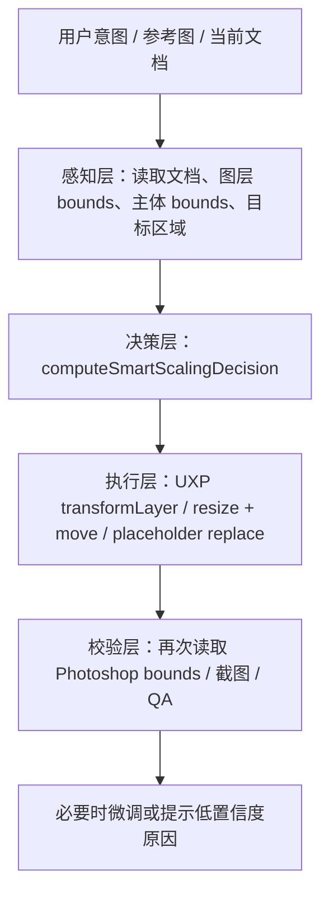

# 智能缩放与 Photoshop 自由变换研究计划

## 结论先行

当前项目没有真正完成“符合审美的智能缩放”。

项目里已经存在多套相关实现，但它们解决的是局部问题：

- UXP `transformLayer`：能执行缩放、翻转、旋转和 fit-to-canvas，属于底层执行工具。
- UXP `smart-layout-engine`：有一套本地 fillRatio 启发式，能按占位区域计算缩放和居中。
- Agent `SmartLayoutService`：可以基于抠图或剪切蒙版边界估算主体，再计算 scale 和 position。
- `reference-replication-placement`：可以把参考图中的图片区映射为目标框，并计算 contain / cover / anchor 类 transform。
- `aesthetic-decision-service`：有审美决策原型，但没有成为稳定执行链路的真相源。

真实问题不是“没有缩放代码”，而是：

1. 没有统一的缩放语义。
2. 没有统一的输入契约。
3. 没有统一的置信度和风险表达。
4. 没有执行后读取 Photoshop bounds 再校验的闭环。
5. 缺少真实 benchmark 来证明“看起来更好”。

## 为什么这项能力难

设计里的“大小合适”不是固定百分比。

Agent 至少需要知道：

- 画布尺寸和安全区。
- 当前图层真实 bounds。
- 商品或人物的主体 bounds，而不是整张图片 bounds。
- 目标区域来自哪里：模板占位、参考图解析、当前选区、画布安全区，还是用户显式指定。
- 素材角色：商品、模特、细节图、场景图、图标、背景。
- 设计类型：主图、详情页、SKU、海报、Banner、参考图复刻。
- 用户意图：主视觉、辅助图、缩略图、铺满背景、适配槽位、组合对比。
- 是否允许裁切，以及裁切是否会伤害主体。

如果缺少这些信息，只能做保守几何计算，不能声称已经具备审美级自由变换能力。

## 本轮新增真相源

新增文件：

- `src/shared/design-smart-scaling-policy.ts`

作用：

- 定义智能缩放的统一输入输出。
- 统一 designType、assetRole、intent、targetBox、subjectBox、cropPolicy 等概念。
- 输出 scale、destinationBox、subjectDestinationBox、fillRatio、subjectVisibleRatio、cropRisk、confidence、warnings。
- 明确：没有 subjectBox 或 targetBox 时必须降低置信度。

它不是 Photoshop 执行器。
它只是“缩放决策策略入口”，用于后续让 Agent、参考图复刻、主图、详情页、SKU 等链路共享同一套缩放语义。

## 推荐架构

## 分层边界

### 1. 感知层

负责收集事实，不做审美决策。

已有可复用能力：

- UXP `getSubjectBounds`：基于 alpha 或 Photoshop 选择主体获取主体区域。
- Agent `SmartLayoutService.detectSubject`：基于抠图模型或剪切蒙版估算主体。
- UXP 文档快照与图层 bounds：用于知道当前图层真实位置和大小。

待补：

- 将当前图层 bounds、主体 bounds、目标区域统一成 `SmartScalingInput`。
- 对“目标区域来源”进行标记，例如 `template-slot`、`reference-region`、`canvas-safe-area`。

### 2. 决策层

负责回答：

- 缩放多少？
- 放在哪里？
- 主体是否可见？
- 裁切风险是什么？
- 置信度是多少？

本轮新增：

- `computeSmartScalingDecision`
- `getSmartScalingPreset`
- `formatSmartScalingPolicyForPlanner`

待补：

- 将主图、详情页、SKU、参考图复刻现有缩放逻辑逐步迁移到这个策略入口。
- 不一次性删除旧逻辑，先做并行计算和日志对比，确认没有影响现有功能。

### 3. 执行层

负责把决策变成 Photoshop 操作。

已有能力：

- `transformLayer`
- `moveLayer`
- `replaceImagePlaceholder`
- `fillDetailPage`

待补：

- 新增一个明确的执行适配器：把 `SmartScalingDecision.destinationBox` 转换成 Photoshop 可执行的 resize + move。
- 处理智能对象、普通像素层、剪切蒙版、组图层的差异。
- 执行后读取真实 bounds，与计划值比较。

### 4. 校验层

当前最弱。

必须补：

- 执行后重新获取图层 bounds。
- 对比目标框、主体框、可见比例。
- 对参考图复刻任务，截图后进行视觉 QA。
- 将失败原因返回为“低置信度 / 缺少主体边界 / 裁切风险 / 执行不一致”，而不是假装完成。

## 与现有代码的关系

### 可复用

- `DesignEcho-UXP/src/tools/layer/transform-layer.ts`
  - 适合作为低层 transform 执行工具。

- `DesignEcho-UXP/src/tools/image/get-subject-bounds.ts`
  - 适合作为 Photoshop 内主体 bounds 感知工具。

- `src/main/services/smart-layout-service.ts`
  - 可继续用于图片文件级主体检测，尤其是没有打开 PSD 图层时。

- `src/shared/reference-replication-placement.ts`
  - 可继续用于参考图图片区到模板槽位的几何映射。

### 需要收口

- `DesignEcho-UXP/src/tools/layout/smart-layout-engine.ts`
  - 目前有独立 fillRatio 算法，后续应改为消费共享策略或至少对齐参数语义。

- `src/renderer/services/design-skills/main-image-design.skill.ts`
  - 目前主图 scale 和 smartLayoutPayload 是主图内部计算，后续应迁移到智能缩放策略入口。

- `src/renderer/services/skill-executors/main-image.executor.ts`
  - 当前失败时回退到 `transformLayer(scaleUniform)`，这只能保证有动作，不能保证审美落位。

- `src/main/services/aesthetic/aesthetic-decision-service.ts`
  - 当前属于审美决策原型，不能当成已完成能力宣传。

## MVP 验收口径

第一阶段不追求“所有设计都好看”，只验证基础闭环：

1. 给定画布、图片、主体 bounds、目标框。
2. 系统输出可解释的缩放决策。
3. Photoshop 执行 resize + move。
4. 执行后读取 bounds。
5. 生成报告：计划值、实际值、偏差、主体可见比例、裁切风险。

通过条件：

- 不再只返回固定百分比。
- 缺少主体 bounds 时能明确降级。
- 不把计划 transform 当成执行成功。
- 主图、详情页、参考图复刻至少各有一个真实案例可复核。

## 风险

1. Photoshop layer bounds 与视觉主体 bounds 不一致。
2. 普通图层、智能对象、组、剪切蒙版的 transform 行为不同。
3. Photoshop `resize` 默认以图层中心变换，必须配合 move 校准。
4. `boundsNoEffects` 与 `bounds` 在阴影、描边、发光存在时可能不同。
5. 模型能给“看起来合理”的建议，但如果没有真实 bounds 和 QA，执行会漂。
6. 没有 benchmark 就无法证明审美变好，只能证明代码路径可运行。

## 下一步实现顺序

1. 将智能缩放策略接入参考图复刻执行计划，但先只生成 `smartScalingDecision` 元数据。
2. 为 UXP 增加一个安全执行适配器：按 `destinationBox` 执行 resize + move，然后读取真实 bounds。
3. 在主图链路中并行计算新旧缩放结果，先记录差异，不直接替换。
4. 选择 3 个真实样例建立 benchmark：主图、详情页图片区、参考图复刻图片区。
5. 差异可接受后，再逐步替换分散的 fillRatio / scaleUniform 逻辑。
