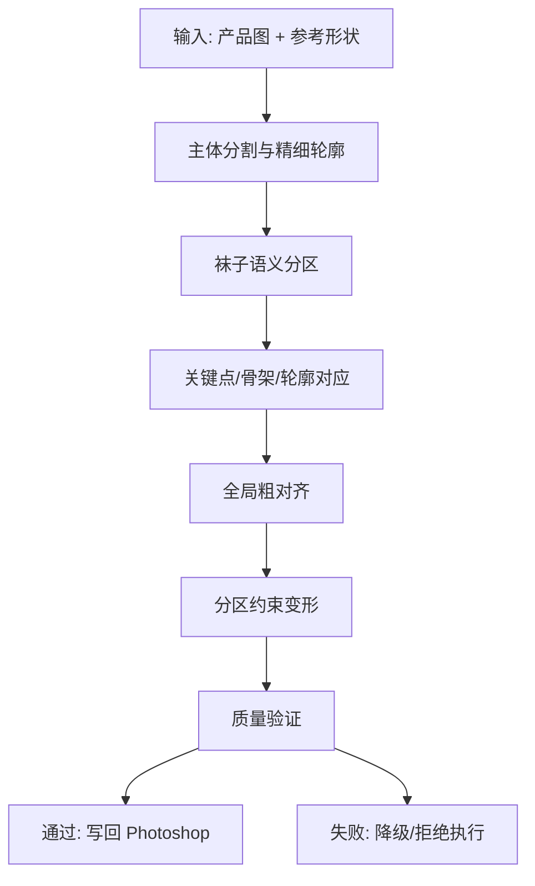

# 袜子形态统一方案研究与实施计划

## 1. 目标

为多张袜子产品图提供可靠的“形态统一”能力：

- 用户导入多张袜子图
- 用户绘制一个参考形状图层，作为目标轮廓
- 系统将每只袜子调整到统一形态
- 变形后要求：
  - 形态自然、工整
  - 针织纹理尽量整齐
  - 图案、Logo、文字不明显拉伸或剪切
  - 袜口异形结构需要保护：
    - 花边
    - 木耳边
    - 平口
    - 卷边

这不是普通的全局 Warp，也不是简单的轮廓匹配。它本质上是一个“分区约束的非刚性变形”问题。

## 2. 当前仓库真实情况

当前仓库里已经有不少相关代码，但对外暴露的链路还没有收成一条可靠主线。

### 已有模块

- `C:\DesignEcho\DesignEcho-Agent\src\renderer\services\skill-executors\shape-morphing.executor.ts`
- `C:\DesignEcho\DesignEcho-UXP\src\tools\morphing\morph-executor.ts`
- `C:\DesignEcho\DesignEcho-UXP\src\tools\morphing\contour-detector.ts`
- `C:\DesignEcho\DesignEcho-Agent\src\main\services\sock-morphing\sock-morph-engine.ts`
- `C:\DesignEcho\DesignEcho-Agent\src\main\services\sock-morphing\sock-morph-integration.ts`
- `C:\DesignEcho\DesignEcho-Agent\src\main\services\morphing\optimized-morphing-service.ts`
- `C:\DesignEcho\DesignEcho-Agent\src\main\services\morphing\enhanced-morph-executor.ts`

### 当前问题

1. `shape-morphing.executor.ts` 很薄，只负责把参数转给工具，不承担真正的设计/验证逻辑。
2. `morph-executor.ts` 主要停留在“准备变形数据”的阶段，实际变形执行并不完整。
3. `sock-morph-integration.ts` 已经尝试接 `Puppet Warp` 和 Agent 端变形，但执行分支仍有明显 TODO。
4. `contour-detector.ts` 当前轮廓提取质量不够稳，失败时会退到 bounding box，这对袜口异形保护远远不够。
5. 虽然仓库已经有 `MLS`、内容分析、袜口保护、区域分析等组件，但没有形成一条可靠、可验证、可回退的最终执行链。

### 结论

当前代码库不是“完全没有基础”，而是：

- 已有很多中间件
- 但对外暴露链不完整
- 执行路径不统一
- 质量门槛和失败策略不够清晰

因此不应该在现有薄链路上继续叠兜底逻辑，而应该重构成一条明确的分阶段流水线。

## 3. 不能采用的方案

### 3.1 不能只靠 Photoshop 自带 Puppet Warp

原因：

- 只能做粗形态调整
- 对纹理和图案保护不够
- 袜口异形区域容易被拉坏
- 缺少区域级刚性/半刚性约束

可以用，但只能作为“最后执行器”之一，不能作为唯一算法核心。

### 3.2 不能做单一全局 TPS/Warp

原因：

- 全局平滑变形会让图案、文字、针织纹理一起被拉伸
- 袜口花边/木耳边会被带着扭
- 对局部异形保护不足

TPS 可以做粗对齐，不适合直接做最终结果。

### 3.3 不能把图案保护交给模型“自己理解”

原因：

- 这类任务的失真是几何问题，不是语言理解问题
- 模型可以帮助识别区域，但不能替代确定性变形约束

## 4. 推荐方案

推荐采用：

**语义分区 + 轮廓/骨架对应 + 分区约束变形 + 质量验证**

核心思想：

- 先识别袜子各个语义区域
- 再建立参考形状对应关系
- 最后做“分区、限应变、带保护”的变形

## 5. 建议的算法流水线

### 5.1 主体分割与精细轮廓

目标：

- 获取稳定的袜子 mask
- 获取精细轮廓
- 尽量避免直接从纹理边缘误检

建议：

- 已有抠图链可复用时优先复用
- 不要再让失败路径回退为简单 bounding box
- 单独输出：
  - 主体 mask
  - 轮廓 contour
  - 袜口候选区域 mask

### 5.2 袜子语义分区

建议最少分成：

- cuff（袜口）
- leg（筒身）
- heel（后跟）
- foot（脚掌）
- toe（袜尖）
- patterned areas（图案/Logo/文字）

其中：

- `cuff` 是高优先级保护区
- `patterned areas` 是低应变区
- `plain knit` 区域允许适度连续变形

### 5.3 关键点、骨架、轮廓对应

目标：

- 让源袜子和参考形状建立稳定对应

建议：

- 先做轮廓采样
- 再做骨架提取
- 关键点至少包含：
  - 袜口左右边界点
  - 筒身中轴点
  - 后跟转折点
  - 袜尖端点
  - 足底主要弯折点

说明：

- 参考形状图层并不自带语义，需要从参考轮廓中推断区域边界
- 如果对应点质量太差，应直接拒绝自动统一，不要硬做

### 5.4 全局粗对齐

只做：

- 平移
- 旋转
- 尺度对齐
- 必要时轻量 TPS

目的：

- 让后续局部变形不需要承担大尺度差异

### 5.5 分区约束变形

这是核心。

推荐优先级：

1. **分区 ARAP / 网格变形**
2. **相似/刚性 MLS**
3. **TPS 仅用于粗形变，不作为最终主变形**

建议的区域约束：

- `cuff`
  - 刚性或近刚性
  - 只允许整体平移、轻微旋转、极小尺度变化
- `patterned areas`
  - 限制局部剪切与各向异性拉伸
  - 必要时局部优先保持宽高比
- `plain knit`
  - 允许中等强度连续变形
- `heel/toe`
  - 允许一定结构重塑，但应限制折角畸变

### 5.6 质量验证

必须有，不然这功能不可靠。

至少验证：

- 轮廓匹配误差
- cuff distortion score
- pattern strain score
- local shear / anisotropy
- overall naturalness heuristics

当以下情况发生时应拒绝自动执行：

- 袜口结构差异过大
- 图案区域被预测为明显变形
- 关键点对应置信度过低
- 形变强度超过阈值

## 6. 适合 DesignEcho 的落地架构

### 6.1 Core 层

新增或收口以下核心对象：

- `SockMask`
- `SockSemanticRegions`
- `SockMorphCorrespondence`
- `SockWarpPlan`
- `SockMorphValidation`

### 6.2 主服务分层

建议拆成：

1. `sock-shape-analysis-service`
   - 分割、轮廓、区域、关键点、图案区分析

2. `sock-warp-planner-service`
   - 参考形状对应
   - 生成粗对齐与分区变形 plan

3. `sock-warp-validator-service`
   - 验证 plan 是否安全

4. `sock-warp-executor-service`
   - 将 plan 执行到 Photoshop

当前仓库里已有部分能力可迁入：

- `optimized-morphing-service.ts`
- `enhanced-morph-executor.ts`
- `sock-morph-engine.ts`

### 6.3 UXP 层职责

UXP 不应该再承担“算法本体”。

UXP 更适合做：

- 读图层
- 读 shape/path
- 获取 crop/pixels
- 生成/更新智能对象
- 执行 batchPlay/Puppet Warp/Transform Warp
- 把结果写回文档

### 6.4 Agent/Main 层职责

算法核心应主要放在 Agent/Main 侧：

- 语义分区
- 关键点/骨架对应
- 变形 plan
- 质量验证
- 失败策略

## 7. Photoshop 执行策略

推荐采用“非破坏优先”的方案。

### 推荐路径

1. 原袜子图层转 Smart Object
2. 在 Agent 侧生成最终位移场或中间变形结果
3. Photoshop 侧做：
   - 必要的粗对齐
   - Smart Object 替换/更新
   - 局部 Warp/Liquify 微调
4. 保留中间 mask 与保护区

### 不推荐路径

直接在 Photoshop 里只靠：

- Puppet Warp
- Liquify
- 手工 pin mesh

来完成全部统一。这样很难保证批量稳定。

## 8. MVP 范围

第一版不应试图一口气吃完所有袜子类型。

### MVP 支持

- 单只平铺袜子
- 参考形状明确
- 普通平口 / 简单卷边
- 纯色或低密度图案袜
- 小到中等形变差异

### MVP 暂不承诺

- 极复杂花边/镂空袜口
- 大面积复杂印花、提花、文字 logo
- 严重透视变化
- 多只重叠
- 严重遮挡

## 9. 推荐的实施阶段

### Phase 1：把现有链路收成可运行主线

目标：

- 收口当前半成品实现
- 不再停留在“准备变形数据”

具体做法：

- 统一对外入口
- 去掉薄链路中的 TODO 分叉
- 明确当前实际执行器是哪个
- 建立最小质量门槛

### Phase 2：语义分区与保护区

目标：

- 建立袜口保护
- 建立图案区保护

### Phase 3：分区约束变形

目标：

- 替换单一全局变形
- 使用分区 ARAP / MLS 主路径

### Phase 4：质量验证与拒绝执行

目标：

- 给出可靠失败边界
- 避免把图做坏

## 10. 当前代码建议改造顺序

### 第一步

先审计并统一当前对外执行路径：

- `shape-morphing.executor.ts`
- `morph-executor.ts`
- `sock-morph-integration.ts`

回答清楚：

- 当前 UI 点击“形态统一”到底走哪条主线
- 哪些分支是死代码
- 哪些能力是已接线未执行

### 第二步

把轮廓提取升级为高质量输入，不再允许 bounding box 作为主失败回退。

### 第三步

把现有的：

- `optimized-morphing-service.ts`
- `enhanced-morph-executor.ts`

合并成明确的 warp planner + validator 结构。

### 第四步

建立质量评分和拒绝执行机制。

## 11. 评估指标

这功能不能只看“轮廓像不像”。

应至少评估：

- silhouette IoU / contour distance
- cuff preservation score
- pattern deformation score
- local shear score
- visual acceptability by category

## 12. 参考方法与来源

以下方法适合做算法参考，不表示必须原样实现：

- Shape Context  
  - Belongie, Malik, Puzicha  
  - https://proceedings.neurips.cc/paper/2000/file/c44799b04a1c72e3c8593a53e8000c78-Paper.pdf

- Coherent Point Drift (CPD)  
  - Myronenko, Song  
  - https://arxiv.org/abs/0905.2635

- Thin-Plate Spline / Principal Warps  
  - Bookstein  
  - https://alliance.seas.upenn.edu/~cis581/Lectures/Fall2017/CIS581Fall17-PrincipalWarps.pdf

- As-Rigid-As-Possible Shape Manipulation  
  - Igarashi et al.  
  - https://cs.brown.edu/people/jhughes/papers/Igarashi-ASM-2005/paper.pdf

- Image Deformation Using Moving Least Squares  
  - Schaefer et al.  
  - https://people.engr.tamu.edu/schaefer/research/mls.pdf

- GrabCut  
  - Rother et al.  
  - https://pages.cs.wisc.edu/~dyer/cs534-spring10/papers/grabcut-rother.pdf

- Mask R-CNN  
  - He et al.  
  - https://arxiv.org/abs/1703.06870

- Adobe Puppet Warp  
  - https://helpx.adobe.com/photoshop/desktop/effects-filters/artistic-stylize-filters/distort-specific-image-areas-with-puppet-warp.html

- Adobe Transform Warp  
  - https://helpx.adobe.com/photoshop/using/warp-images-shapes-paths.html

- Adobe Displace Filter  
  - https://helpx.adobe.com/si/photoshop/using/applying-specific-filters.html

- Adobe Liquify / Freeze Mask  
  - https://helpx.adobe.com/lu_en/photoshop/using/liquify-filter.html

## 13. 最终判断

这个能力可以做，但不能按“普通变形功能”做。

可靠实现的前提是：

- 高质量轮廓
- 语义分区
- 保护区约束
- 分区变形
- 强质量验证

如果继续沿当前“薄 skill + 半成品 UXP morph + TODO integration”路线堆代码，只会继续产生：

- 形态统一看似能跑
- 实际结果容易扭曲
- 袜口和图案被做坏

这条能力应该被当成一个独立的算法工作流来建设，而不是一个简单的 Photoshop 小工具。
